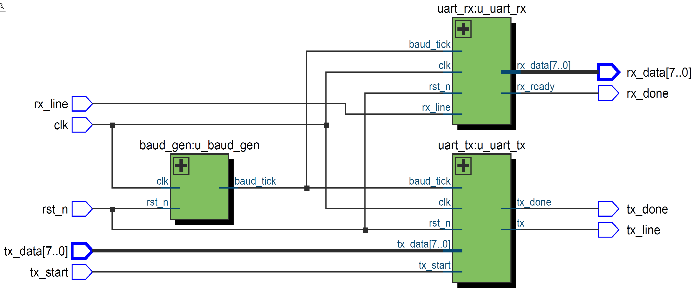

# UART Controller in Verilog

This project implements a basic UART (Universal Asynchronous Receiver/Transmitter) transmitter and receiver using Verilog, along with a testbench for simulation and waveform validation. Additionally, an example Instruction Set Architecture (ISA) is documented for an integrated ALU controller.

---

## 🧱 RTL Architecture

The design is based on modular RTL components:

- `uart_tx.v` – UART transmitter
- `uart_rx.v` – UART receiver
- `uart_top.v` – Integration module (with optional `SIM` mode)
- `baud_gen.v` – Baud rate generator (skipped in simulation)

### 📘 Diagram



---

## 📶 Simulation Waveform

Simulation shows successful transmission and reception of `tx_data = 0xA5`, with correct loopback through `rx_line`.

### 📷 Waveform Output


---

## 📋 Instruction Set Architecture (ISA)

Below is an example of an 8-bit instruction set for an integrated ALU controller:

| Opcode (instr[7:4]) | Instruction | Description                                |
|---------------------|-------------|--------------------------------------------|
| `0001`              | LOAD A      | Load `instr[3:0]` into Register A          |
| `0010`              | LOAD B      | Load `instr[3:0]` into Register B          |
| `0100`              | ADD         | ALU performs `A + B`                       |
| `0101`              | SUB         | ALU performs `A - B`                       |
| `0110`              | AND         | ALU performs bitwise `A & B`               |
| `0111`              | OR          | ALU performs bitwise `A | B`               |
| `1000`              | MUL         | ALU performs `A * B`                       |
| `1001`              | SHL         | ALU performs logical left shift `A << 1`   |
| `1010`              | SHR         | ALU performs logical right shift `A >> 1`  |
| `1011`              | BEQ addr    | Branch to `addr` if `A == B`               |
| `1100`              | STORE       | Store ALU result to `data_result`         |

---

## 📂 Project Structure

```plaintext
UART_Project/
├── src/                    ← Verilog RTL source files
│   ├── uart_tx.v
│   ├── uart_rx.v
│   ├── uart_top.v
│   └── baud_gen.v
├── sim/                    ← Simulation testbench & output
│   ├── uart_top_tb.v
│   └── wave_uart_top_tb.png
├── RTL_uart_top.png        ← RTL block diagram
├── README.md
├── .gitignore
└── LICENSE (MIT)

▶️ Simulation (ModelSim)
💡 SIM Mode
In simulation, baud_tick is replaced with clk using define SIM.

🔁 Steps:
# Compile RTL and Testbench
vlog src/*.v sim/*.v

# Start simulation
vsim work.uart_top_tb

# Load waveform
add wave *

# Run full simulation
run -all
✅ Simulation Output
You should see the following:

=== UART Loopback Test Done ===
TX Data: 0xA5
RX Data: 0xA5
✅ UART simulation passed!
